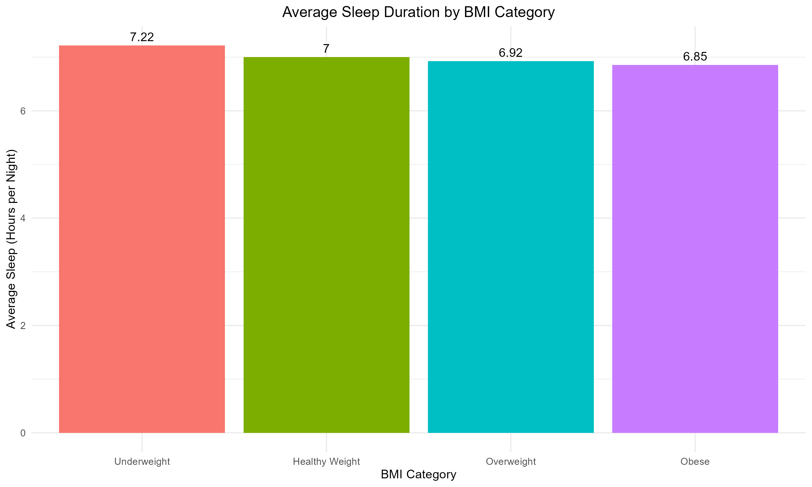
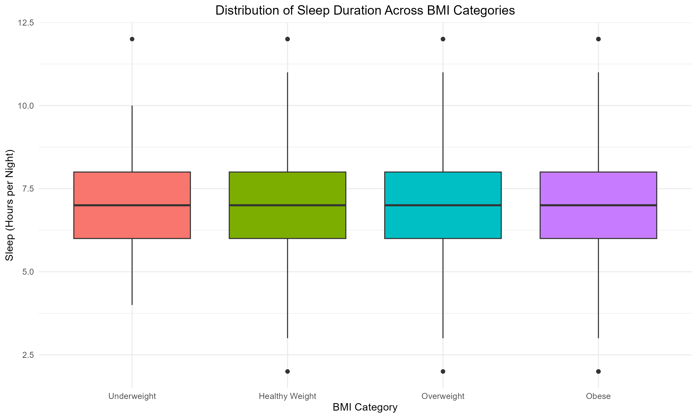
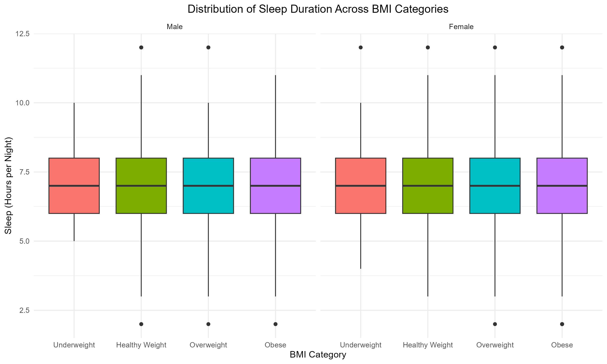

# Sleep Duration and BMI Analysis Using NHANES

## Overview

This project explores the relationship between sleep duration and body mass index (BMI) among U.S. adults using data from the National Health and Nutrition Examination Survey (NHANES). The analysis was completed in R and demonstrates data cleaning, transformation, visualization, and summary statistics using the tidyverse.

---

## Research Question

**How does sleep duration differ across BMI categories among U.S. adults?**

---

## Dataset

**Dataset:** NHANES

The National Health and Nutrition Examination Survey (NHANES) is a nationally representative survey conducted by the Centers for Disease Control and Prevention (CDC) that collects demographic, health, nutrition, laboratory, and examination data from the U.S. population.

Variables used in this analysis include:

- BMI
- BMI Category (created during data cleaning)
- Sleep Hours per Night
- Gender

---

## Methods

The analysis included:

- Importing and cleaning NHANES data
- Removing observations with missing BMI or sleep values
- Creating BMI categories using `case_when()`
- Reordering BMI categories using `factor()`
- Calculating summary statistics with `group_by()` and `summarise()`
- Creating visualizations with **ggplot2**

---

## Results

### Figure 1. Average Sleep Duration by BMI Category

Average sleep duration showed a slight downward trend across BMI categories, with individuals in higher BMI categories reporting fewer hours of sleep on average. However, the differences between groups were relatively small. This figure is descriptive and cannot determine whether the observed differences are statistically significant.

---

### Figure 2. Distribution of Sleep Duration by BMI Category

The boxplot supports the trend observed in the bar chart, with slightly lower median sleep duration in higher BMI categories. The distributions overlapped substantially, and the interquartile ranges were similar across all BMI categories, suggesting that variability in sleep duration was relatively consistent among the groups.

## Summary Statistics

The table below provides descriptive statistics for sleep duration within each BMI category and complements the distribution shown in Figure 2.

| BMI Category | Sample Size | Mean Sleep | Median | SD | Q1 | Q3 | IQR |
|--------------|------------:|-----------:|--------:|---:|---:|---:|----:|
| Underweight | 157 | 7.22 | 7 | 1.42 | 6 | 8 | 2 |
| Healthy Weight | 2359 | 7.00 | 7 | 1.33 | 6 | 8 | 2 |
| Overweight | 2489 | 6.92 | 7 | 1.27 | 6 | 8 | 2 |
| Obese | 2678 | 6.85 | 7 | 1.42 | 6 | 8 | 2 |

---

### Figure 3. Distribution of Sleep Duration by BMI Category and Gender

When separated by gender, males and females displayed very similar patterns across BMI categories. Both groups showed a slight decrease in median sleep duration as BMI category increased, while the overall distributions remained highly overlapping. Although the number and location of outliers varied slightly between genders, the overall relationship between BMI and sleep duration was consistent.

---

## Key Findings

- Average sleep duration decreased slightly as BMI category increased.
- The differences in sleep duration between BMI categories were relatively small.
- Sleep duration distributions were similar across BMI categories and showed substantial overlap.
- Similar patterns were observed among both males and females.
- Additional statistical analyses would be required to determine whether the observed differences are statistically significant.

---

## Skills Demonstrated

- R Programming
- dplyr
- ggplot2
- Data Cleaning
- Data Wrangling
- Exploratory Data Analysis (EDA)
- Data Visualization
- Summary Statistics

---

## Future Improvements

Potential extensions of this project include:

- Statistical hypothesis testing (e.g., ANOVA)
- Multiple linear regression
- Logistic regression
- Additional demographic comparisons
- Interactive visualizations

---

## Author

**Sebastian Radovic**

Bachelor of Health Science

Master of Public Health (In Progress)

Interested in data analytics, epidemiology, and public health research.
---
